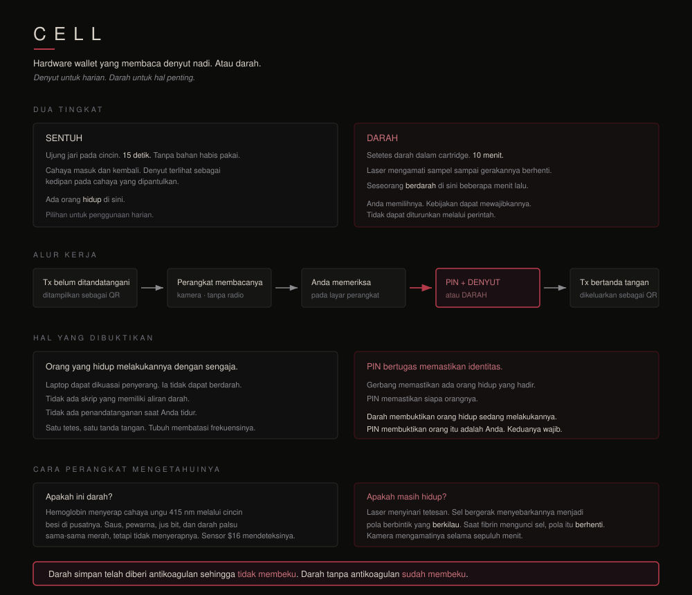
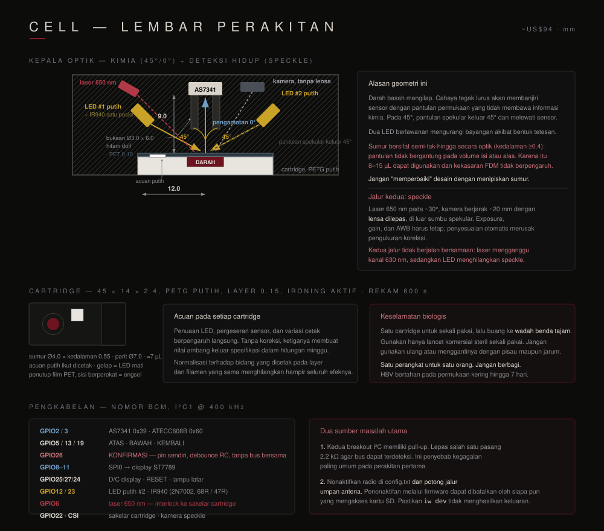
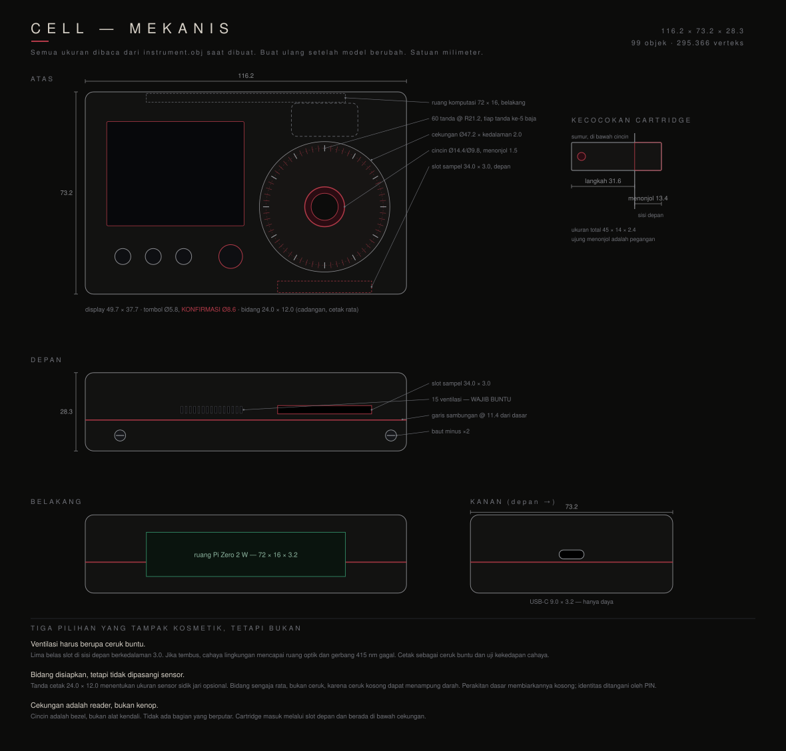
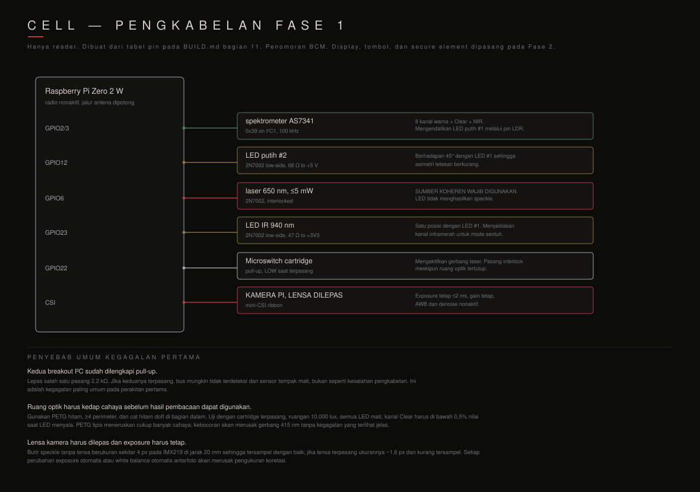

# POIDH Bounty #24: Hardware Wallet CELL

[English](./README.md) | **Bahasa Indonesia**

Direktori ini berisi rencana, daftar kerja, dan catatan pengujian untuk mengikuti [POIDH Mainnet bounty #24](https://poidh.xyz/mainnet/bounty/24). Tugasnya adalah merakit CELL dan membuktikan bahwa perangkat tersebut dapat mengotorisasi tanda tangan menggunakan denyut nadi maupun darah segar.

## Cara kerja CELL

Diagram perakitan, mekanis, dan pengkabelan

### Lembar perakitan

### Gambar mekanis

### Pengkabelan reader

Diagram di atas merupakan terjemahan bahasa Indonesia dari desain [`z0r0z/cell`](https://github.com/z0r0z/cell) pada commit `9ae536c92186ba7d0d8e0f1a12ccf68c7f27446e`. Sumber aslinya menggunakan lisensi CC0 1.0.

## Dokumen acuan

- [Syarat bounty](https://github.com/z0r0z/cell/blob/main/BOUNTY.md)
- [Petunjuk perakitan](https://github.com/z0r0z/cell/blob/main/BUILD.md)
- [Daftar komponen](https://github.com/z0r0z/cell/blob/main/BOM.csv)
- [Aturan keselamatan](https://github.com/z0r0z/cell/blob/main/SAFETY.md)
- [Status validasi yang sudah diketahui](https://github.com/z0r0z/cell/blob/main/VALIDATION.md)
- [Petunjuk pencetakan 3D](https://github.com/z0r0z/cell/blob/main/PRINTING.md)
- [Kontrak POIDH V3](https://etherscan.io/address/0xE731dFadBFf20542E10D09D26Fc71445C70d4232)

## Acuan tetap

- Branch CELL: `main`
- Commit acuan: `9ae536c92186ba7d0d8e0f1a12ccf68c7f27446e`
- Jaringan: Ethereum Mainnet
- ID bounty: `24`
- Kontrak POIDH: `0xE731dFadBFf20542E10D09D26Fc71445C70d4232`
- Pembuat bounty: `0x1C0Aa8cCD568d90d61659F060D1bFb1e6f855A20`
- Tanggal pencatatan: `2026-08-26`

Status dan saldo bounty dapat berubah di blockchain. Periksa lagi sebelum membeli komponen dan sebelum mengirim klaim.

## Hasil yang dapat diklaim

### Perangkat lengkap

Selesaikan milestone 1–12 pada bagian 15 `BUILD.md`, lalu sertakan:

1. Foto atau video perangkat yang sudah dirakit dan sedang beroperasi.
2. Tanda tangan yang diotorisasi dengan denyut nadi.
3. Tanda tangan yang diotorisasi dengan darah segar.
4. Transaksi on-chain yang dihasilkan. Transaksi testnet diperbolehkan.
5. Catatan lengkap tentang perubahan dari rancangan acuan.

### Hasil reader saja

Selesaikan milestone 7, lalu publikasikan hasil pengujian sampel tiruan (*spoof panel*), `thresholds.json`, data mentah dalam `captures/`, serta catatan perangkat keras dan kalibrasi.

### Kegagalan yang dapat direproduksi

Kegagalan pada perangkat keras nyata juga dapat diajukan jika hasilnya berguna dan dapat direproduksi. Simpan data mentah jika sampel palsu lolos, darah asli gagal, atau rancangan optik dalam dokumentasi tidak memberikan hasil yang diharapkan.

## Biaya menurut proyek

| Tahap | Biaya |
|---|---:|
| Perangkat keras reader | $62,25 |
| Bahan habis pakai reader | $31,00 |
| Perangkat keras wallet | $35,30 |
| Total | **$128,55** |

Angka tersebut belum mencakup ongkir, pajak, alat kerja, pengambilan sampel, komponen pengganti, kegagalan cetak, dan gas Mainnet. Siapkan tambahan 25–35% untuk kendala perangkat keras serta dana gas secara terpisah.

## Aturan keselamatan yang wajib dipatuhi

- Baca `SAFETY.md` sebelum menangani sampel apa pun.
- Gunakan lancet komersial yang steril, tersegel, dan hanya sekali pakai.
- Jangan berbagi peralatan yang pernah bersentuhan dengan darah.
- Buang lancet bekas ke wadah benda tajam dan ikuti aturan pembuangan setempat.
- Jangan mengambil darah dari vena tanpa bantuan tenaga medis yang kompeten.
- Gunakan seed baru khusus pengujian dan dana testnet. Jangan gunakan wallet pribadi.
- Jangan simpan atau publikasikan PIN, frasa pemulihan, private key, maupun layar yang memuat rahasia.
- Uji ATECC608B secara menyeluruh sebelum menjalankan perintah penguncian yang tidak dapat dibatalkan.

Dokumen berikutnya: [rencana pelaksanaan](./PLAN.id.md), [daftar kerja](./CHECKLIST.id.md), dan [catatan pengujian software](./SOFTWARE_BASELINE.id.md).
